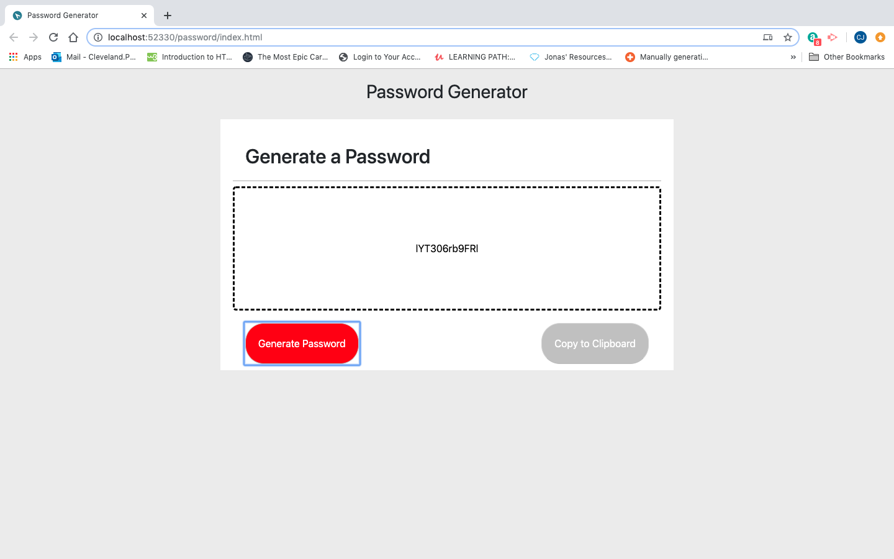

# password
Password Generator
I started by getting and example from different websites of their password generators. I then looked at a fews tutorial of password generators using html. 
For my password generator I started with jumbotron in bootstrap.  I then added the second button so that I could use it for the copy to clipboard. 
https://clevelandjr.github.io/password/
Included are two images of my assignment. One of my site when you first log onto it. The second is the result after a password is generated.

